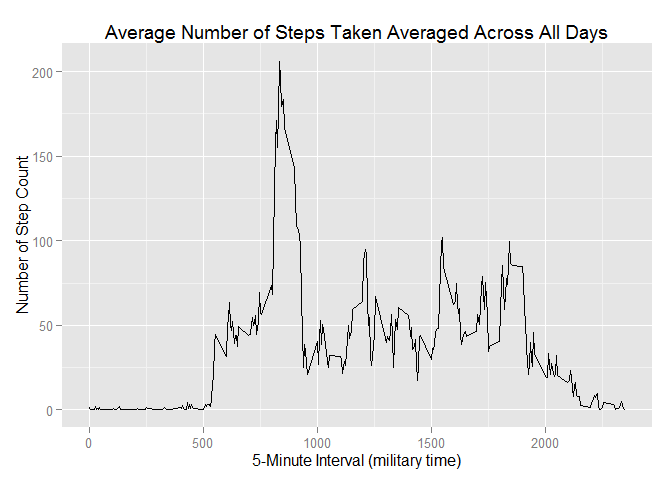

# Reproducible Research: Peer Assessment 1


## Loading and preprocessing the data

```r
setwd("C:\\Users\\Anki\\Documents\\GitHub\\RepData_PeerAssessment1")
data <- read.table(unz("activity.zip", "activity.csv"), header=T, quote="\"", sep=",")
data$date <- as.Date(data$date) 
```


## What is mean total number of steps taken per day?


```r
data.ignore.na <- na.omit(data) 

# sum steps by date
daily.steps <- rowsum(data.ignore.na$steps, format(data.ignore.na$date, '%Y-%m-%d')) 
daily.steps <- data.frame(daily.steps) 
names(daily.steps) <- ("steps") 

#histogram

hist(daily.steps$steps, 
     main=" ",
     breaks=10,
     xlab="Total Number of Steps Taken Daily")
```

 

```r
# print mean
mean(daily.steps$steps); 
```

```
## [1] 10766.19
```

```r
#print median
median(daily.steps$steps) 
```

```
## [1] 10765
```


## What is the average daily activity pattern?


```r
library(plyr)
# Calculate average steps for each of 5-minute interval during a 24-hour period
interval.mean.steps <- ddply(data.ignore.na,~interval, summarise, mean=mean(steps))

# time series plot
library(ggplot2)
qplot(x=interval, y=mean, data = interval.mean.steps,  geom = "line",
      xlab="5-Minute Interval (military time)",
      ylab="Number of Step Count",
      main="Average Number of Steps Taken Averaged Across All Days"
      )
```

 

```r
# Which 5-minute interval, on average across, contains the maximum number of steps?
interval.mean.steps[which.max(interval.mean.steps$mean), ]
```

```
##     interval     mean
## 104      835 206.1698
```

## Imputing missing values


```r
# Calculate and report the total number of missing values in the dataset (i.e. the total number of rows with NAs)
library(sqldf)
```

```
## Loading required package: gsubfn
## Loading required package: proto
## Loading required package: RSQLite
## Loading required package: DBI
```

```r
tNA <- sqldf(' 
    SELECT d.*            
    FROM "data" as d
    WHERE d.steps IS NULL 
    ORDER BY d.date, d.interval ') 
```

```
## Loading required package: tcltk
```

```r
NROW(tNA) 
```

```
## [1] 2304
```

```r
t1 <- sqldf('
    SELECT d.*, i.mean
    FROM "interval.mean.steps" as i
    JOIN "data" as d
    ON d.interval = i.interval 
    ORDER BY d.date, d.interval ') 

t1$steps[is.na(t1$steps)] <- t1$mean[is.na(t1$steps)]

t1.total.steps <- as.integer( sqldf(' 
    SELECT sum(steps)  
    FROM t1') );

t1.total.steps.by.date <- sqldf(' 
    SELECT date, sum(steps) as "t1_total_steps_by_date" 
    FROM t1 GROUP BY date 
    ORDER BY date') 

daily.61.steps <- sqldf('   
    SELECT date, t1_total_steps_by_date as "steps"
    FROM "t1.total.steps.by.date"
    ORDER BY date') 

hist(daily.61.steps$steps, 
     main=" ",
     breaks=10,
     xlab="After Imputate NA -Total Number of Steps Taken Daily")
```

 

```r
#Calculate and report the mean and median total number of steps taken per day.
t1.mean.steps.per.day <- as.integer(t1.total.steps / NROW(t1.total.steps.by.date) )
t1.mean.steps.per.day
```

```
## [1] 10766
```

```r
t1.median.steps.per.day <- median(t1.total.steps.by.date$t1.total.steps.by.date)
```

```
## Warning in is.na(x): is.na() applied to non-(list or vector) of type
## 'NULL'
```

```r
t1.median.steps.per.day
```

```
## NULL
```
## Are there differences in activity patterns between weekdays and weekends?


```r
t1$weektime <- as.factor(ifelse(weekdays(t1$date) %in% 
                c("Saturday","Sunday"),"weekend", "weekday"))

t5 <- sqldf('   
    SELECT interval, avg(steps) as "mean.steps", weektime
    FROM t1
    GROUP BY weektime, interval
    ORDER BY interval ')

# Make a panel plot containing a time series plot (i.e. type = "l") of the 5-minute interval (x-axis) and the average number of steps taken, averaged across all weekday days or weekend days (y-axis).

library("lattice")
p <- xyplot(mean.steps ~ interval | factor(weektime), data=t5, 
       type = 'l',
       main="Average Number of Steps Taken 
       \nAveraged Across All Weekday Days or Weekend Days",
       xlab="5-Minute Interval (military time)",
       ylab="Average Number of Steps Taken")
print (p)  
```

 
